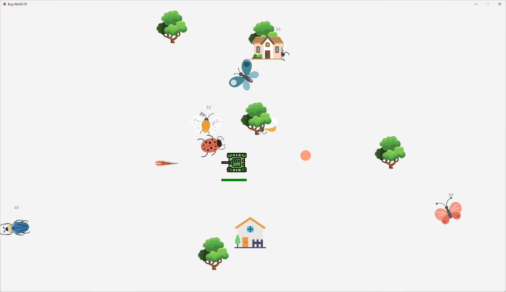

# Bug World-FX 
## Introduction:
This is my first JavaFX program. After using ecs100.jar for an entire paper, finally we got a more advanced GUI framework to build games and apps.   
This is a game where you control a tank to fight bugs.   
Find the executable application (bug_world-fx.exe) from Google Drive:  
[Edmond's Java Program Collection.zip (Windows)](https://drive.google.com/file/d/1JnsHsp5DMIYMjxFSXQ2bWQ5w6bDB_L0V/view?usp=sharing)

## Snapshot

## Hot Keys
**Esc**: start/pause  
**Up/Down/Right/Left**: control tank  
**Space**: fire  

## Features
- Bugs move in a smooth arc, and always face the direction they are moving.
- The tank can fire to the bugs, and the bugs will also attack the tank.
- Speed control.

## Tech Stack 
| Type | Name |
| ----------- | ----------- 
| Programming Language | Java |
| GUI Library | Java FX |
| GUI Tool | Scene Builder|

## Run Instruction
### Requirement:
- Java Runtime Environment
- Java FX
### Steps:   
To run the application in your local machine, please follow the steps below:
1. Clone the repository from the github  
2. Add JavaFX to Build Path
3. Add the VM argrements to the run configure:  
`--module-path "<PATH TO YOUR JavaFX/lib>" --add-modules javafx.controls,javafx.fxml`
4. Run the *BugWorldFX_Main.java* in the *application* package.

## License
MIT